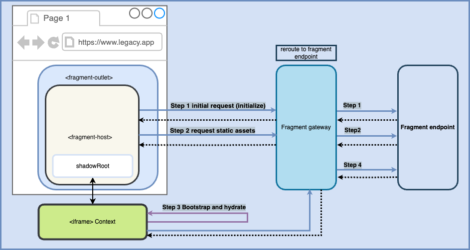

_Last updated_: December 8, 2024

## Web Fragments middleware

The middleware is typically a server-side executed script that processes requests and responses intercepted in the communication between server to client and client to server.

## Existing middleware

Middleware examples available

- [Cloudflare Pages](https://github.com/web-fragments/web-fragments/blob/main/packages/web-fragments/src/gateway/middlewares/cloudflare-pages/index.ts)
- [Express Server](https://github.com/anfibiacreativa/web-fragments-migration-demo/blob/main/packages/polylithic-app/shell-prod-server/src/_middleware/fragment-express-middleware.ts) (suitable for containerization)

Coming up: Fastify, Azure Functions and Netlify

---

Middleware typically introduces types and methods and other functionality, that connects the technology and infrastructure agnostic libraries, to required vendor code.

In the case of `Web Fragments`, middleware will be responsible for identifying and classifying client-side requests by using the `sec-fetch-dest` headers.

### Case 1: sec-fetch-dest identifies an iframe request

When a request's `sec-fetch-dest` equals iframe, the server must respond with an empty HTML template, and set the `Content-Type` header to `text-html`

```javascript
if (request.headers["sec-fetch-dest"] === "iframe") {
	response.setHeader("content-type", "text/html");
	return response.end("<!doctype html><title>");
}
```

### Case 2: sec-fetch-header identifies a document request

For documents, the middleware should defer the request to the server in place to serve the request as expected and, when applicable, embed the fragment in the `fragment` placeholder.

```javascript
if (request.headers["sec-fetch-dest"] === "document") {
	next();
}
```

### Case 3: sec-fetch-header identifies a script request

For scripts, the corresponding header should be set.

```javascript
if (request.headers["sec-fetch-dest"] === "script") {
	response.setHeader("content-type", "text/javascript");
}
```

### Fetching fragment

Once the requests are identified, and when there is a fragment match, the middlware uses the [gateway](./gateway) to fetch the corresponding fragment and the [reframing](./reframed) mechanism kicks in.



## Processing assets

### Scripts

In the case of scripts, they will be loaded, reframed and encapsulated in the corresponding `iframe context`. This isolates the execution, preventing pollution and reducing security concerns.

#### Offloading scripts

A key diffefrentiator of this approach, is that scripts are not only loaded but also offloaded when browsing away from a reframed view, with the consequent release of memory and mitigation of memory leaks.

To understand how `reframed` works and what it does, go to the [reframed](./reframed) document.

## Eager-rendering or piercing

Eager-rendering is the process of rendering a server side rendered fragment, before a client-side legacy application has been bootstrapped.

To do so, the middleware rewrites the HTML for the document in the response, embedding the fragment before the application renders client-side. The fragment is immediately interactive boosting `Interactive to Next Paint` scores, and `prePiercingStyles` prevent `Cummulative Layout Shift` and `Largest Content Paint`. To know more about performance metrics, visit [this page](https://web.dev/articles/vitals)

### Rewriting the HTML

Our team uses [Worker Tools HTML rewriter](https://github.com/worker-tools/html-rewriter) to manipulate the streams and rewrite the resulting HTML, in our middlewares.

This is an example of rewriting the HTML before reframing

```javascript
{
// other code
...
// process the fragment response for embedding into the host document
  function processFragmentForReframing(fragmentResponse: Response) {
    console.log('[Debug Info | processFragmentForReframing]');

    return new HTMLRewriter()
      .on("script", {
        element(element: any) {
          const scriptType = element.getAttribute("type");
          if (scriptType) {
            element.setAttribute("data-script-type", scriptType);
          }
          element.setAttribute("type", "inert");
        },
      })
      .transform(fragmentResponse);
  }

  // render an error response if something goes wrong
  function renderErrorResponse(err: unknown, response: ExpressResponse) {
    if (err instanceof Error) {
      response.status(500).send(`<p>Error: ${err.message}</p>`);
    } else {
      response.status(500).send('<p>Unknown error occurred.</p>');
    }
  }
}

function mergeStreams(...streams: NodeReadable[]) {
  let combined = new NodePassThrough()
  for (let stream of streams) {
    const end = stream === streams.at(-1);
    combined = stream.pipe(combined, { end })
  }
  return combined;
}

```

---

#### Authors

<ul class="authors">
    <li class="author"><a href="https://github.com/anfibiacreativa">anfibiacreativa</a></li>
    <li class="author"><a href="https://github.com/igorminar">IgorMinar</a></li>
</ul>
