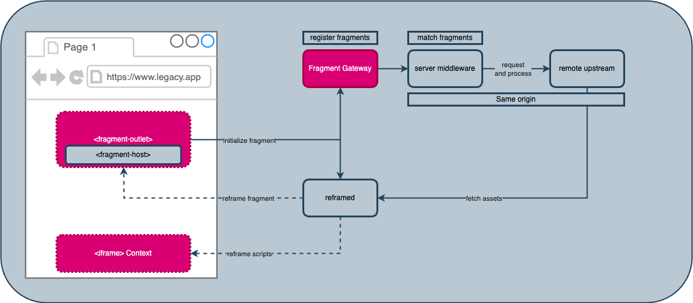

_Last updated_: December 8, 2024

The `reframed` library is small program consisting of about a thousand lines of code and [TBD] kbs., responsible for fetching the `fragment` assets, creating and destroying the iframe context, [portaling](./glossary#portaling) the assets and handling all events, including navigation history events of the `Web Fragments` framework.

The following diagram describes how the `reframed` mechanism works, at an architecture high level.




### API Reference

# Reframed API Reference

| **Function/Property**          | **Description**                                                                                  | **Parameters**                                                                                                                                                                                | **Example**                                                                                     |
|---------------------------------|--------------------------------------------------------------------------------------------------|-----------------------------------------------------------------------------------------------------------------------------------------------------------------------------------------------|-------------------------------------------------------------------------------------------------|
| `monkeyPatchIFrameEnvironment`  | Patches iframe size properties (`innerWidth`, `outerWidth`, `innerHeight`, etc.) to match the main window's properties. | - `iframeWindow`: The window object of the iframe.<br>- `mainWindow`: The main window object providing dimension values.                                                                        | `monkeyPatchIFrameEnvironment(iframeWindow, mainWindow);`                                       |
| `initializeMessageHandler`      | Sets up a message handler for iframe-to-parent or iframe-to-iframe communication.                | - `targetWindow`: The window where the message handler should be initialized.                                                                                                                 | `initializeMessageHandler(window);`                                                            |
| `iframeWindowProps`             | Binds iframe dimensional properties to values from the main window for environment synchronization. | N/A                                                                                                                                                                                           | *Access through the patched iframe window environment.*                                         |

---

## Usage Example

Although reframed can be used as a standalone library in certain scenarios, the recommendation is to use it via `Web Fragments` using the `fragment-outlet`. Here is an example of how reframed can be used standalone.

### Reframing a module

Consider an application folder structure that includes a publicly accessible `component.html` page, in a trusted origin. It can be appended to the page in this way.

```javascript
// Reframing the component

import { reframed } from './packages/reframed/dist/reframed.js';

const endpoints = ['component.html'];
const ref = `./${endpoints[0]}`;
const refId = ref.replace(/\.html$/, '');
const tagName = 'section';
const { container } = reframed(ref, { containerTagName: tagName });

container.setAttribute('style', 'border:3px dotted red');
container.setAttribute('id', `${tagName}-${refId}`);

// append the reframed component to the DOM
const main = document.body.querySelector('main');
main.appendChild(container);
```

### Patching IFrame Properties

Reframed can also be used to monkeyPatch iframe contexts in this way:

```ts
import { monkeyPatchIFrameEnvironment } from 'reframed';

monkeyPatchIFrameEnvironment(iframeWindow, mainWindow);
console.log(iframeWindow.innerWidth);
````
